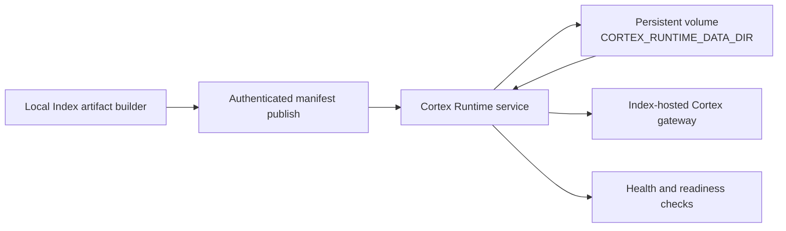

# Cortex Runtime Service

Small Railway-friendly artifact service for the first 1D3X Cortex rollout.
It is intentionally not a model server or a second memory runtime. It stores
the validated Cortex chunk manifest on a persistent volume and serves it to the
Index-hosted Cortex gateway.

## System Map



Keep this map updated when publish/auth flow, storage location, gateway contract, or readiness checks change.

## Contract

- `GET /health` is public and returns service/artifact readiness metadata.
- `GET /manifest` requires `Authorization: Bearer <CORTEX_RUNTIME_TOKEN>`.
- `PUT /manifest` requires the same bearer token and accepts JSON or gzip JSON.
- uploads are validated for Cortex schema, minimum chunks and `index`/`mn7r`/
  `cropto` coverage before atomic replacement;
- the manifest is stored under `CORTEX_RUNTIME_DATA_DIR` (Railway volume:
  `/data`), never in the container layer.

## Railway setup

The first deployed instance is
`https://1d3x-cortex-runtime-production.up.railway.app`.

Deploy this directory with `railway up ./services/cortex-runtime
--path-as-root --new --name 1d3x-cortex-runtime`. The included
`railway.toml` selects the Dockerfile and `/health` check. Attach a persistent
volume mounted at `/data`, and set:

```text
CORTEX_RUNTIME_TOKEN=<long-random-secret>
CORTEX_RUNTIME_MIN_CHUNKS=100
CORTEX_RUNTIME_DATA_DIR=/data
```

Then configure the Index/Vercel project:

```text
CORTEX_CHUNK_MANIFEST_URL=https://<cortex-runtime-domain>/manifest
CORTEX_CHUNK_MANIFEST_BEARER_TOKEN=<same-runtime-secret>
CORTEX_INTERNAL_API_SECRET=<separate-index-internal-secret>
```

Publish the local artifact through the existing Index command:

```bash
export CORTEX_ARTIFACT_UPLOAD_URL=https://<cortex-runtime-domain>/manifest
export CORTEX_ARTIFACT_UPLOAD_TOKEN=<same-runtime-secret>
npm run cortex:artifact-publish -- --manifest=.cortex/chunk-manifest.runtime.json
```

After configuring Vercel, run `npm run check:cortex-runtime` against the Index
health URL. Keep the runtime token separate from the Index internal API secret.
